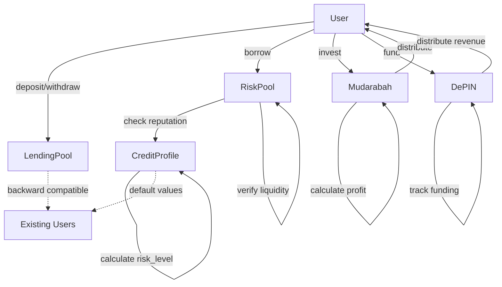
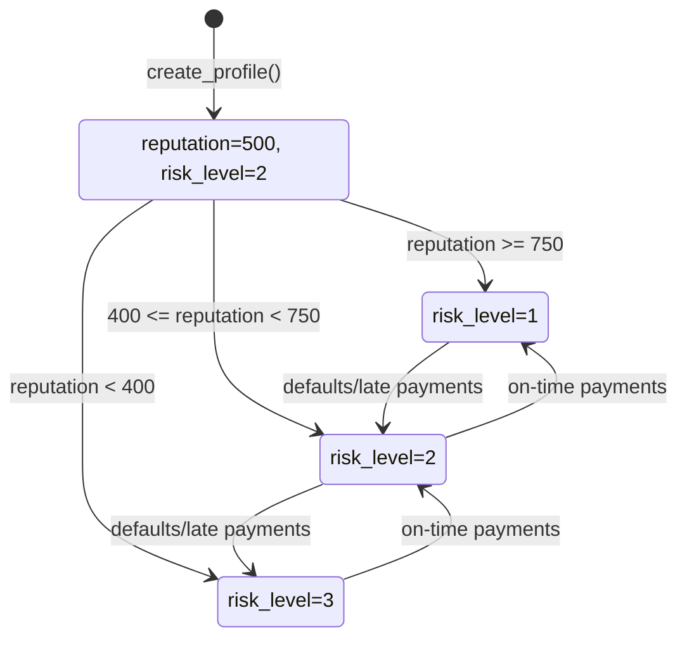

# Design Document: Advanced DeFi Features

## Overview

This design extends MoonCreditFi with advanced DeFi capabilities including credit-aware risk-based lending pools, Islamic finance-compliant profit-sharing (Mudarabah), enhanced credit profiles with reputation tracking, and DePIN revenue distribution. The system maintains full backward compatibility with existing modules while introducing new risk-tiered borrowing, reputation-based access control, and deterministic profit distribution mechanisms.

### Key Features

- **Enhanced Credit Profiles**: Extended with debt tracking, reputation scores (0-1000), and risk levels (1-3)
- **Risk-Based Lending Pools**: Three-tier pool system (low/medium/high risk) with reputation-based access control
- **Mudarabah Module**: Sharia-compliant profit-sharing with deterministic distribution
- **DePIN Revenue Tracking**: Cumulative funding and revenue tracking with proportional distribution
- **Backward Compatibility**: All existing functions continue to work without modification

### Design Principles

1. **Backward Compatibility First**: Existing contracts and data structures remain unchanged
2. **Deterministic Execution**: All calculations are on-chain without external dependencies
3. **Security by Design**: Comprehensive validation, underflow/overflow protection, and atomic transactions
4. **Gas Optimization**: Minimal storage writes and efficient computation
5. **Auditability**: Events emitted for all critical state changes

## Architecture

### Module Structure

```
mooncreditfi/
├── credit_profile.move (EXTENDED)
│   ├── Enhanced with: debt, reputation, risk_level fields
│   ├── Reputation update logic
│   └── Backward-compatible getters with defaults
├── lending_pool.move (UNCHANGED)
│   └── Existing deposit/withdrawal/yield logic
├── risk_pool.move (NEW)
│   ├── Risk-tiered lending pools
│   ├── Credit-aware borrowing
│   └── Reputation threshold enforcement
├── mudarabah.move (NEW)
│   ├── Islamic finance profit-sharing
│   ├── Deterministic profit calculation
│   └── Investor/manager distribution
├── depin.move (EXTENDED)
│   ├── Enhanced with: total_funded, total_revenue fields
│   ├── Revenue distribution logic
│   └── Proportional share calculation
├── collateral.move (UNCHANGED)
│   └── Existing collateral management
└── lending_logic.move (UNCHANGED)
    └── Existing borrow/repay orchestration
```

### Component Interactions



### Data Flow

1. **Credit Profile Enhancement Flow**
   - User creates profile → Initialize debt=0, reputation=500, risk_level=2
   - Loan repaid on time → reputation += 10, recalculate risk_level
   - Loan defaults → reputation -= 20, recalculate risk_level

2. **Risk-Based Borrowing Flow**
   - User requests borrow → Check reputation threshold for pool risk_level
   - Reputation sufficient → Verify liquidity → Approve borrow
   - Reputation insufficient → Abort with EInsufficientReputation

3. **Mudarabah Profit Distribution Flow**
   - Calculate profit = current_balance - pool_capital
   - investor_share = (profit * profit_ratio) / 10000
   - manager_share = profit - investor_share
   - Distribute deterministically

4. **DePIN Revenue Distribution Flow**
   - Calculate user_share = (user_funding / total_funded) * revenue
   - Verify treasury balance
   - Transfer proportional share

## Components and Interfaces

### 1. Enhanced Credit Profile Module

#### Extended Data Structure

```move
public struct CreditProfile has key, store {
    id: UID,
    owner: address,
    score: u64,
    debt: u64,                    // NEW: Current outstanding debt
    reputation: u64,              // NEW: Reputation score (0-1000)
    risk_level: u8,               // NEW: Risk tier (1=low, 2=medium, 3=high)
    total_borrowed: u64,
    total_repaid: u64,
    loan_count: u64,
    default_count: u64,
    repayment_history_count: u64,
    last_activity_time: u64,
    last_loan_time: u64,
    active_loans: vector<address>,
}
```

#### New Functions

```move
// Getters
public fun get_debt(profile: &CreditProfile): u64
public fun get_reputation(profile: &CreditProfile): u64
public fun get_risk_level(profile: &CreditProfile): u8

// Package-level updaters
public(package) fun update_debt(profile: &mut CreditProfile, new_debt: u64)
public(package) fun update_reputation(profile: &mut CreditProfile, new_reputation: u64)
public(package) fun update_risk_level(profile: &mut CreditProfile, new_risk_level: u8)

// Reputation logic
public(package) fun update_reputation_on_repayment(
    profile: &mut CreditProfile,
    is_on_time: bool
)
```

#### Reputation Update Algorithm

```
function update_reputation_on_repayment(profile, is_on_time):
    if is_on_time:
        if profile.reputation < 1000:
            profile.reputation = min(profile.reputation + 10, 1000)
    else:  // late or default
        if profile.reputation > 20:
            profile.reputation = profile.reputation - 20
        else:
            profile.reputation = 0
    
    // Update risk_level based on new reputation
    if profile.reputation >= 750:
        profile.risk_level = 1  // low risk
    else if profile.reputation >= 400:
        profile.risk_level = 2  // medium risk
    else:
        profile.reputation = 3  // high risk
```

### 2. Risk Pool Module

#### Data Structure

```move
public struct RiskPool has key, store {
    id: UID,
    total_liquidity: u64,
    risk_level: u8,              // 1=low, 2=medium, 3=high
    balance: Balance<SUI>,
}
```

#### Core Functions

```move
// Pool creation
public entry fun create_risk_pool(
    risk_level: u8,
    ctx: &mut TxContext
)

// Deposit operations
public entry fun deposit_to_risk_pool(
    pool: &mut RiskPool,
    payment: Coin<SUI>,
    ctx: &mut TxContext
)

// Credit-aware borrowing
public entry fun borrow_from_risk_pool(
    pool: &mut RiskPool,
    profile: &CreditProfile,
    amount: u64,
    ctx: &mut TxContext
): Coin<SUI>
```

#### Reputation Threshold Logic

```
function check_reputation_threshold(pool_risk_level, user_reputation):
    if pool_risk_level == 1:  // low risk pool
        return user_reputation >= 600
    else if pool_risk_level == 2:  // medium risk pool
        return user_reputation >= 400
    else:  // high risk pool (risk_level == 3)
        return true  // any reputation allowed
```

### 3. Mudarabah Module

#### Data Structure

```move
public struct MudarabahPool has key, store {
    id: UID,
    pool_capital: u64,           // Initial investment
    profit_ratio: u64,           // Profit split in basis points (0-10000)
    balance: Balance<SUI>,
    manager: address,
}
```

#### Core Functions

```move
// Pool creation
public entry fun create_mudarabah_pool(
    initial_capital: Coin<SUI>,
    profit_ratio: u64,
    ctx: &mut TxContext
)

// Profit calculation
public fun calculate_profit(pool: &MudarabahPool): u64

// Profit distribution
public entry fun distribute_profit(
    pool: &mut MudarabahPool,
    investor: address,
    ctx: &mut TxContext
)
```

#### Profit Calculation Algorithm

```
function calculate_profit(pool):
    current_balance = balance::value(&pool.balance)
    if current_balance > pool.pool_capital:
        return current_balance - pool.pool_capital
    else:
        return 0  // No profit if balance below capital

function distribute_profit(pool, investor):
    profit = calculate_profit(pool)
    investor_share = (profit * pool.profit_ratio) / 10000
    manager_share = profit - investor_share
    
    // Transfer shares
    transfer(investor_share, investor)
    transfer(manager_share, pool.manager)
```

### 4. Enhanced DePIN Module

#### Extended Data Structure

```move
public struct DepinProject has key, store {
    id: UID,
    name: String,
    description: String,
    target_amount: u64,
    current_amount: u64,
    apy: u64,
    is_active: bool,
    treasury_balance: Balance<SUI>,
    total_funded: u64,           // NEW: Cumulative funding
    total_revenue: u64,          // NEW: Cumulative revenue
}
```

#### New Functions

```move
// Getters
public fun get_total_funded(project: &DepinProject): u64
public fun get_total_revenue(project: &DepinProject): u64

// Revenue tracking
public(package) fun record_revenue(
    project: &mut DepinProject,
    amount: u64
)

// Revenue distribution
public entry fun distribute_revenue(
    project: &mut DepinProject,
    nft: &DepinNFT,
    ctx: &mut TxContext
)
```

#### Revenue Distribution Algorithm

```
function distribute_revenue(project, nft, user):
    user_funding = nft.amount
    total_funding = project.total_funded
    
    // Prevent division by zero
    assert!(total_funding > 0, EDivisionByZero)
    
    // Calculate proportional share
    user_share = (project.total_revenue * user_funding) / total_funding
    
    // Verify treasury has sufficient balance
    assert!(treasury_balance >= user_share, EInsufficientTreasury)
    
    // Transfer share
    transfer(user_share, user)
    
    emit RevenueDistributedEvent(user, user_share, timestamp)
```

## Data Models

### Credit Profile State Transitions



### Risk Pool Access Control

| Pool Risk Level | Minimum Reputation | Access Control |
|----------------|-------------------|----------------|
| 1 (Low Risk)   | 600               | Strict         |
| 2 (Medium Risk)| 400               | Moderate       |
| 3 (High Risk)  | 0                 | Open           |

### Mudarabah Profit Distribution

| Component | Calculation | Recipient |
|-----------|-------------|-----------|
| Total Profit | current_balance - pool_capital | - |
| Investor Share | (profit * profit_ratio) / 10000 | Investor |
| Manager Share | profit - investor_share | Manager |

### DePIN Revenue Shares

| Investor | Funding Amount | Share Calculation |
|----------|---------------|-------------------|
| User A   | 1000 SUI      | (1000 / total_funded) * total_revenue |
| User B   | 500 SUI       | (500 / total_funded) * total_revenue |
| User C   | 1500 SUI      | (1500 / total_funded) * total_revenue |

### Error Codes

| Code | Constant | Description |
|------|----------|-------------|
| 1 | EInsufficientReputation | User reputation below pool threshold |
| 2 | EInsufficientLiquidity | Pool lacks funds for borrow request |
| 3 | EInvalidRiskLevel | Risk level not in range 1-3 |
| 4 | EInvalidProfitRatio | Profit ratio exceeds 10000 basis points |
| 5 | EInsufficientTreasury | Treasury lacks funds for distribution |
| 6 | EDivisionByZero | Attempted division by zero |
| 7 | EUnderflowPrevention | Arithmetic would cause underflow |
| 8 | EOverflowPrevention | Arithmetic would cause overflow |


## Correctness Properties

*A property is a characteristic or behavior that should hold true across all valid executions of a system-essentially, a formal statement about what the system should do. Properties serve as the bridge between human-readable specifications and machine-verifiable correctness guarantees.*

### Property Reflection

After analyzing all acceptance criteria, I identified the following redundancies:
- Properties 2.2 and 2.5 are subsumed by 2.1 and 2.4 (explicit conditions already covered)
- Properties 5.6 and 5.8 are subsumed by 5.3-5.5 and 5.7 (error cases covered by main properties)
- Properties 8.4 is subsumed by 8.3 (error case covered by main property)
- Properties 9.5-9.7 are redundant with 9.1-9.4 (backward compatibility already tested)
- Properties 10.3-10.4 are redundant with 5.3-5.7 (already tested in risk pool)
- Properties 12.4-12.5 and 12.7 are redundant with 12.2-12.3 (precision covered by round-trip)

The following properties provide unique validation value and will be implemented:

### Property 1: Credit Profile Getter Consistency

*For any* credit profile, calling getter functions for debt, reputation, and risk_level should return the values stored in those fields.

**Validates: Requirements 1.6**

### Property 2: Credit Profile Update Persistence

*For any* credit profile and valid values for debt, reputation, and risk_level, calling update functions should persist those values such that subsequent getter calls return the updated values.

**Validates: Requirements 1.7**

### Property 3: Reputation Increase on On-Time Repayment

*For any* credit profile with reputation less than 1000, recording an on-time loan repayment should increase reputation by 10 points (capped at 1000).

**Validates: Requirements 2.1, 2.2**

### Property 4: Reputation Decrease on Default

*For any* credit profile, recording a default or late repayment should decrease reputation by 20 points (floored at 0).

**Validates: Requirements 2.4, 2.5**


### Property 5: Risk Level Calculation from Reputation

*For any* credit profile, after updating reputation, the risk_level should be: 1 if reputation >= 750, 2 if 400 <= reputation < 750, or 3 if reputation < 400.

**Validates: Requirements 2.7, 2.8, 2.9**

### Property 6: Risk Pool Creation Validation

*For any* risk_level value not in {1, 2, 3}, attempting to create a risk pool should fail with an error.

**Validates: Requirements 3.5**

### Property 7: Risk Pool Getter Consistency

*For any* risk pool, calling getter functions for total_liquidity and risk_level should return the values stored in those fields.

**Validates: Requirements 3.7, 3.8**

### Property 8: Risk Pool Deposit Increases Liquidity

*For any* risk pool and deposit amount, depositing SUI should increase total_liquidity by exactly the deposit amount.

**Validates: Requirements 4.4**

### Property 9: Risk Pool Deposit Event Emission

*For any* risk pool deposit, a DepositEvent should be emitted containing the user address, deposit amount, and the new total_liquidity value.

**Validates: Requirements 4.5**

### Property 10: Risk Pool Reputation Threshold for Low Risk

*For any* risk_level 1 pool and credit profile, a borrow request should only succeed if the profile's reputation is greater than or equal to 600.

**Validates: Requirements 5.3**

### Property 11: Risk Pool Reputation Threshold for Medium Risk

*For any* risk_level 2 pool and credit profile, a borrow request should only succeed if the profile's reputation is greater than or equal to 400.

**Validates: Requirements 5.4**


### Property 12: Risk Pool No Reputation Threshold for High Risk

*For any* risk_level 3 pool and credit profile with any reputation value, a borrow request should succeed (assuming sufficient liquidity).

**Validates: Requirements 5.5**

### Property 13: Risk Pool Liquidity Check

*For any* risk pool and borrow amount, a borrow request should only succeed if total_liquidity is greater than or equal to the borrow amount.

**Validates: Requirements 5.7**

### Property 14: Risk Pool Borrow Decreases Liquidity

*For any* successful borrow from a risk pool, total_liquidity should decrease by exactly the borrow amount.

**Validates: Requirements 5.9**

### Property 15: Risk Pool Borrow Returns Correct Amount

*For any* successful borrow request for amount X, the returned balance should have value equal to X.

**Validates: Requirements 5.11**

### Property 16: Risk Pool Borrow Event Emission

*For any* successful borrow from a risk pool, a BorrowEvent should be emitted containing the user address, borrow amount, and remaining liquidity.

**Validates: Requirements 5.12**

### Property 17: Mudarabah Profit Ratio Validation

*For any* profit_ratio value greater than 10000, attempting to create a Mudarabah pool should fail with an error.

**Validates: Requirements 6.6**

### Property 18: Mudarabah Profit Calculation

*For any* Mudarabah pool, the calculated profit should equal max(0, current_balance - pool_capital).

**Validates: Requirements 6.7**


### Property 19: Mudarabah Profit Distribution Calculation

*For any* Mudarabah pool with profit P and profit_ratio R, the investor_share should equal (P * R) / 10000 and manager_share should equal P - investor_share, such that investor_share + manager_share = P.

**Validates: Requirements 6.9, 6.10**

### Property 20: DePIN Funding Accumulation

*For any* DePIN project and funding amount, recording funding should increase total_funded by exactly the funding amount.

**Validates: Requirements 7.5**

### Property 21: DePIN Revenue Accumulation

*For any* DePIN project and revenue amount, recording revenue should increase total_revenue by exactly the revenue amount.

**Validates: Requirements 7.6**

### Property 22: DePIN Getter Consistency

*For any* DePIN project, calling getter functions for total_funded and total_revenue should return the values stored in those fields.

**Validates: Requirements 7.7**

### Property 23: DePIN Proportional Revenue Distribution

*For any* DePIN project with total_funded > 0, and user with funding amount F, the user's revenue share should equal (total_revenue * F) / total_funded.

**Validates: Requirements 8.2**

### Property 24: DePIN Treasury Sufficiency Check

*For any* DePIN revenue distribution, the distribution should only succeed if the treasury balance is greater than or equal to the calculated share amount.

**Validates: Requirements 8.3**

### Property 25: DePIN Revenue Transfer Correctness

*For any* successful DePIN revenue distribution with calculated share S, the recipient should receive exactly S tokens.

**Validates: Requirements 8.6**


### Property 26: DePIN Revenue Distribution Event Emission

*For any* successful DePIN revenue distribution, a RevenueDistributedEvent should be emitted containing the recipient address, distribution amount, and timestamp.

**Validates: Requirements 8.7**

### Property 27: Lending Pool Backward Compatibility

*For any* existing lending pool deposit or withdrawal operation, the operation should execute successfully with the same behavior as before the upgrade.

**Validates: Requirements 9.1, 9.2**

### Property 28: Collateral Vault Backward Compatibility

*For any* existing collateral vault deposit or borrow recording operation, the operation should execute successfully with the same behavior as before the upgrade.

**Validates: Requirements 9.3, 9.4**

### Property 29: Collateral Withdrawal with Active Loans

*For any* collateral vault with active loans (borrowed_amount > 0), attempting to withdraw collateral should fail with an error.

**Validates: Requirements 10.5**

### Property 30: Liquidation Threshold Verification

*For any* collateral vault, liquidation should only succeed if the collateral ratio is below the liquidation threshold (150%).

**Validates: Requirements 10.6**

### Property 31: Credit Profile Data Round-Trip

*For any* valid credit profile, reading the profile data, formatting it for display, and parsing it back should produce equivalent values for all fields (debt, reputation, risk_level, score, etc.).

**Validates: Requirements 12.1, 12.2, 12.3**


## Error Handling

### Error Strategy

All errors follow a consistent pattern:
1. **Validation First**: Check all preconditions before state modification
2. **Atomic Transactions**: All state changes revert on error
3. **Descriptive Codes**: Each error has a unique code and constant name
4. **Early Returns**: Fail fast with clear error messages

### Error Categories

#### Input Validation Errors
- `EInvalidRiskLevel`: Risk level not in range 1-3
- `EInvalidProfitRatio`: Profit ratio exceeds 10000 basis points
- `EInsufficientReputation`: User reputation below pool threshold

#### State Validation Errors
- `EInsufficientLiquidity`: Pool lacks funds for borrow
- `EInsufficientTreasury`: Treasury lacks funds for distribution
- `EHasActiveLoans`: Cannot withdraw collateral with active loans
- `EAboveLiquidationThreshold`: Cannot liquidate healthy position

#### Arithmetic Safety Errors
- `EUnderflowPrevention`: Subtraction would cause underflow
- `EOverflowPrevention`: Addition/multiplication would cause overflow
- `EDivisionByZero`: Attempted division by zero

### Error Handling Patterns

#### Pattern 1: Threshold Validation
```move
public entry fun borrow_from_risk_pool(
    pool: &mut RiskPool,
    profile: &CreditProfile,
    amount: u64,
    ctx: &mut TxContext
) {
    let reputation = credit_profile::get_reputation(profile);
    let threshold = get_reputation_threshold(pool.risk_level);
    
    // Validate reputation threshold
    assert!(reputation >= threshold, EInsufficientReputation);
    
    // Validate liquidity
    assert!(pool.total_liquidity >= amount, EInsufficientLiquidity);
    
    // Proceed with borrow...
}
```

