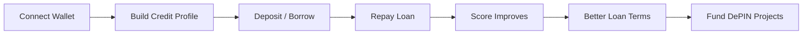
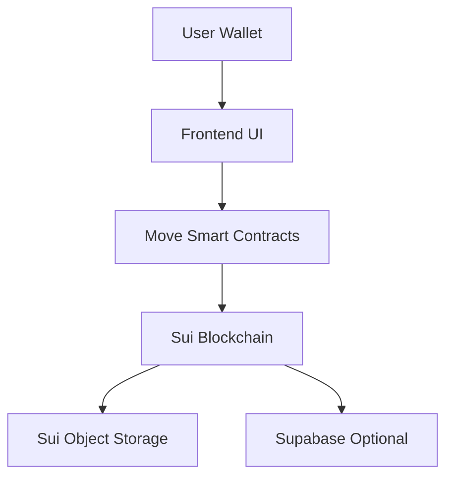
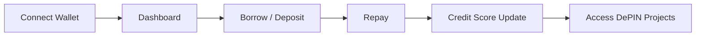
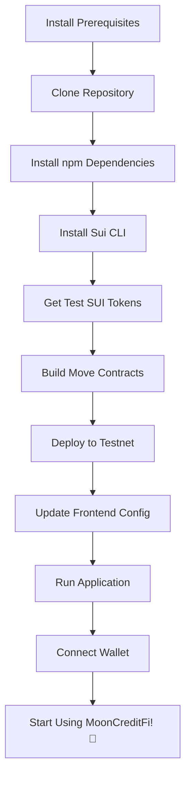

# 🌕 MoonCreditFi

### Decentralized Credit & DePIN Financing Protocol

**Built on Sui Blockchain | Testnet Live | 2026**

---

## 🎉 Deployment Status

**✅ LIVE ON SUI TESTNET**

- **Package ID**: `0x50049e571300f0ea3f493501d99bc46d5ca18e696f25dd2ceae145b54eb45218`
- **Network**: Sui Testnet
- **Deployed**: March 28, 2026
- **Deployer Address**: `0x1b5f1da225b2ead0d8ed23c70bcbe78f872756953870a3429c7f347a239c1160`
- **Explorer**: [View on Suiscan](https://suiscan.xyz/testnet/object/0x50049e571300f0ea3f493501d99bc46d5ca18e696f25dd2ceae145b54eb45218)

### 📦 Deployed Objects

- **Lending Pool**: `0x4d3a3ba82427978d9fe7a0a8f6d93e8c31917c45ed3fced2b09a1431e3678b0c`
- **Credit Profile**: `0x7332d82055668698dfb76c0f25a4da244a99d1e31af30ed0e8e2d9c3cb493ba2`
- **DePIN Project**: `0x6bc7de62357c6573fb1e0f37f0737bf0eeb1a428226afc1003233f00b67e8ee5`

### 🎯 Contract Modules

- ✅ `credit_profile` - Credit scoring and profile management
- ✅ `lending_pool` - Liquidity pool management
- ✅ `lending_logic` - Borrow/lend operations
- ✅ `depin` - DePIN project funding and NFTs

---

## 🚀 Overview

MoonCreditFi is a **credit-aware DeFi + DePIN protocol** that transforms **on-chain credit history into reusable financial infrastructure** on the Sui blockchain.

It introduces:

* 📊 On-chain credit profiles
* 💰 Reputation-based lending
* 🌍 Real-world infrastructure (DePIN) funding
* ⚡ Powered by Sui's high-performance Move smart contracts

> 💡 *Access capital based on trust, not just collateral.*

---

## ❗ Problem

### 🌐 Credit Invisibility

1.7B+ people lack access to financial systems.

### 🔒 Over-Collateralized DeFi

Requires 150–200% collateral.

### 🏗️ Infrastructure Funding Gap

$15T gap in real-world infrastructure.

### 🕶️ Lack of Transparency

Opaque lending decisions and hidden fees.

---

## ✅ Solution

MoonCreditFi combines **credit + lending + infrastructure funding** into a unified protocol.

### 🧩 Core Modules

#### 1. 📊 On-Chain Credit Profiles

* Score range: **300–850**
* Tracks:

  * Loan history
  * Repayments
  * Defaults
* Fully transparent & portable

---

#### 2. 💰 Reputation-Based Lending

* Borrow based on **credit score**
* Lower collateral requirements
* Dynamic interest rates

---

#### 3. 🌍 DePIN Funding Module

* Fund real-world projects (solar, compute, connectivity)
* Earn **real yield**
* Receive **Proof-of-Impact NFTs**

---

## 🔄 Credit Flow



---

## 📊 Credit Score Model

| Score   | Rating    | Max Borrow | Interest |
| ------- | --------- | ---------- | -------- |
| 750–850 | Excellent | 100 SUI    | 3–5%     |
| 650–749 | Good      | 50 SUI     | 5–8%     |
| 550–649 | Fair      | 25 SUI     | 8–12%    |
| 300–549 | Building  | 10 SUI     | 12–15%   |

### 📈 Score Increases

* Repayment: +10–25
* DePIN funding: +5–15
* Consistency: +5–10

### 📉 Score Decreases

* Late payment: -15–30
* Default: -50–100
* Liquidation: -30–50

---

## 🏗️ DePIN Funding

### Example Projects

* 🌞 **Solar Grid Ghana**

  * Target: 50,000 SUI
  * APY: 8–12%

* 💻 **Edge Compute Lagos**

  * Target: 30,000 SUI
  * APY: 10–15%

---

### 💰 Yield Distribution

```text
70% → Investors
20% → Operations
10% → Reserve
```

---

## 🧱 Architecture

### ⚙️ Tech Stack

* **Frontend:** React / Vite, TailwindCSS, Shadcn UI
* **Blockchain:** Sui Blockchain, Move Smart Contracts
* **Wallet Integration:** @mysten/dapp-kit, Sui Wallet
* **State Management:** React Query, Context API
* **Backend:** Supabase (optional)
* **Storage:** Sui Object Storage
* **Network:** Sui Testnet/Mainnet

---

### 🧩 System Diagram



---

## 📜 Move Smart Contracts

**✅ Deployed on Sui Testnet**

```
Package ID: 0x50049e571300f0ea3f493501d99bc46d5ca18e696f25dd2ceae145b54eb45218
Network: Sui Testnet
Modules: credit_profile, lending_pool, lending_logic, depin
```

### 📄 CreditProfile Module

Functions:

* `create_profile()` - Create credit profile (no parameters)
* `get_score()` - Get credit score
* `get_owner()` - Get profile owner
* `record_borrow()` - Record loan (internal)
* `record_repayment()` - Record repayment (internal)
* `record_default()` - Record default (internal)

---

### 💰 LendingPool Module

Functions:

* `create_pool()` - Create lending pool with interest rate
* `get_total_liquidity()` - Get pool liquidity
* `get_total_borrowed()` - Get total borrowed
* `add_liquidity()` - Add liquidity (internal)
* `remove_liquidity()` - Remove liquidity (internal)
* `record_borrow()` - Record borrow (internal)
* `record_repayment()` - Record repayment (internal)

---

### 🔗 LendingLogic Module

Functions:

* `deposit()` - Deposit SUI to pool (uses Coin<SUI>)
* `withdraw()` - Withdraw from pool
* `borrow()` - Borrow with credit check
* `repay()` - Repay loan (uses Coin<SUI>)

---

### 🌍 DePIN Module

Functions:

* `create_project()` - Create DePIN project (name, description, target, APY)
* `fund_project()` - Fund project & receive NFT (uses Coin<SUI>)
* `transfer_nft()` - Transfer investment NFT
* `get_project_name()` - Get project name
* `get_project_target()` - Get funding target
* `get_project_current()` - Get current funding
* `get_project_apy()` - Get project APY

---

## 🔐 Security

* ✅ Move Language Safety (No Reentrancy by Design)
* ✅ Object Capability Model
* ✅ Pausable Contracts
* ✅ Role-Based Access Control
* ✅ Upgradeable Packages
* ✅ Oracle Fallbacks
* ✅ Rate Limiting

---

## 🗺️ Roadmap

### ✅ Phase 1 – Foundation

* Credit system
* Lending MVP
* Sui testnet deployment

### ✅ Phase 2 – DePIN Integration

* Funding module
* Yield system
* Dashboard

### ✅ Phase 3 – Testnet Launch

* Community testing
* Security audits
* Move contract optimization

### 🔜 Phase 4 – Mainnet & Growth

* Sui mainnet deployment
* Partnerships
* Multi-chain expansion

---

## 🖥️ User Flow



---

## 📡 Transparency

All actions are **on-chain & event-driven**:

* Loan creation
* Repayment
* Credit updates
* Funding activity
* Yield distribution

---

## 🔗 Sui Blockchain Benefits

MoonCreditFi leverages Sui's unique features:

* **High Performance**: Sub-second finality for instant credit updates
* **Low Costs**: Affordable transactions for micro-lending
* **Object Model**: Natural representation of credit profiles and loans
* **Move Language**: Built-in safety and formal verification
* **Parallel Execution**: Handle multiple loans simultaneously

---

## 🛠️ Installation

For complete installation instructions, see **[INSTALLATION.md](INSTALLATION.md)**

### Quick Start

```bash
# Clone repository
git clone https://github.com/Zakariasisu5/crypto-glance-haven-821.git
cd crypto-glance-haven-821

# Install dependencies
npm install

# Start development server
npm run dev
```

**Note:** You'll need to deploy Move contracts and update configuration. See [INSTALLATION.md](INSTALLATION.md) for full setup.

### Installation Flow



---

## 🛠️ Quick Start

### Prerequisites

* Node.js 18+
* Sui Wallet browser extension
* Git

### Installation

```bash
# Clone the repository
git clone https://github.com/Zakariasisu5/crypto-glance-haven-821.git
cd crypto-glance-haven-821

# Install dependencies
npm install

# Start development server
npm run dev
```

### Configuration

Update `src/config/sui.js` with your deployed Move package IDs:

```javascript
export const SUI_PACKAGE_ID = '0x50049e571300f0ea3f493501d99bc46d5ca18e696f25dd2ceae145b54eb45218';
export const LENDING_POOL_OBJECT_ID = '0x4d3a3ba82427978d9fe7a0a8f6d93e8c31917c45ed3fced2b09a1431e3678b0c';
export const CREDIT_PROFILE_OBJECT_ID = '0x7332d82055668698dfb76c0f25a4da244a99d1e31af30ed0e8e2d9c3cb493ba2';
export const DEPIN_FINANCE_OBJECT_ID = '0x6bc7de62357c6573fb1e0f37f0737bf0eeb1a428226afc1003233f00b67e8ee5';
export const USE_DEMO_MODE = false;
export const ACTIVE_NETWORK = 'testnet';
```

### Build for Production

```bash
npm run build
npm run preview
```

For detailed documentation, see:
- [Quick Start Guide](QUICK_START.md)
- [Migration Guide](SUI_MIGRATION_GUIDE.md)
- [Production Checklist](PRODUCTION_CHECKLIST.md)

---

## 📬 Contact

**Zakaria Sisu**
📧 [zakariasisu5@gmail.com](mailto:zakariasisu5@gmail.com)

---

## 🌍 Vision

MoonCreditFi aims to become:

* A global **on-chain credit system**
* A **DeFi ↔ real-world bridge**
* A **foundation for credit-based Web3 apps**

---

## 🏁 Conclusion

MoonCreditFi shifts DeFi from:

* Collateral → ✅ Reputation
* Speculation → ✅ Real-world value
* Exclusion → ✅ Financial inclusion

---

🔥 *Build credit. Unlock capital. Fund the future.*
