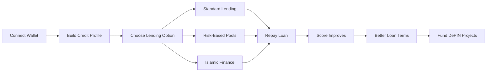
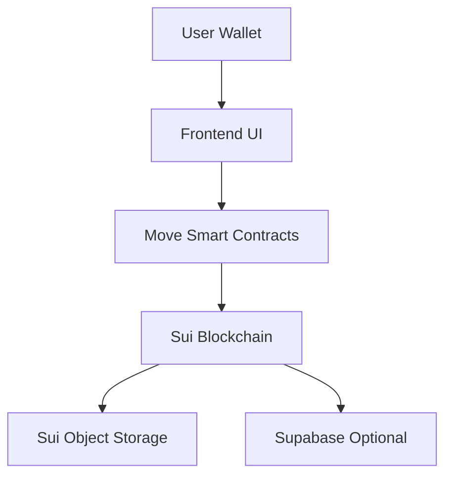
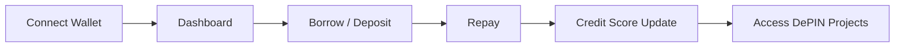
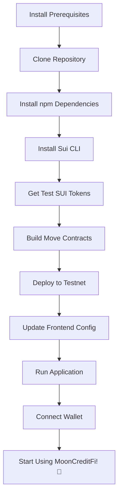

# 🌕 MoonCreditFi

### Decentralized Credit & DePIN Financing Protocol

**Built on Sui Blockchain | Testnet Live | 2026**

---

## 🎉 Deployment Status

**✅ LIVE ON SUI TESTNET**

- **Package ID**: `0x2388af4607e9a5462058b146fe8cbb1e1d2b602862f8205d7a7844fcb4b568e5`
- **Network**: Sui Testnet
- **Deployed**: May 2026
- **Deployer Address**: `0x1b5f1da225b2ead0d8ed23c70bcbe78f872756953870a3429c7f347a239c1160`
- **Explorer**: [View on Suiscan](https://suiscan.xyz/testnet/object/0x2388af4607e9a5462058b146fe8cbb1e1d2b602862f8205d7a7844fcb4b568e5)

### 📦 Core Deployed Objects

- **Profile Registry**: `0x59bee28062384ea12e53a1014dc32443090fc90e15caf4e90d56559d7bff315f`
- **Lending Pool**: `0xb1d0c030979b33b1266984a979c3d98958e0a735b6628d473e5df9166615b03e`
- **Upgrade Cap**: `0xc1f4a8ad5a8526647d61cd4a1e14e8f6cfbc78e3e38354aa9ad7f7a8551abd26`

### 🎯 Risk-Based Lending Pools

- **Low Risk Pool** (Level 1): `0xb70fa7c6e48e0a8f79a3d12c9a7df37f0c9a3d3b3b2cda2aacc0e3bd903d8cc4`
  - Min Reputation: 600+
  - APY: 3.5%
  
- **Medium Risk Pool** (Level 2): `0xdc498215dd5bbaec9377222cefcb559a10f7a814290fbd1572a2df40749b98e6`
  - Min Reputation: 400+
  - APY: 6.5%
  
- **High Risk Pool** (Level 3): `0x9276e0e3f3eeb9653a5c23fadeedc4bfa73e404fbf2870138e9aef2052c82311`
  - Min Reputation: 0 (No minimum)
  - APY: 12.0%

### 🕌 Islamic Finance Pool

- **Mudarabah Pool**: `0x61064a963336445556012d57a7827e342e8fe6eb5be899da4f50263fbf4fab90`
  - Profit-sharing: 70/30 split
  - Sharia-compliant lending

### 🌍 DePIN Projects

- **Solar Farm Network**: `0xc19729095eaf30af890aa66172f906ce9f7050d0cff1137ac460b0fb0a283c36`
- **EV Charging Network**: `0x16ff67f07c3141cccc8602bd13485cd1721d2157c38e4d725471910ee6769eb5`
- **IoT Sensor Network**: `0x067bb4f01c62c6ffb2962a351e718beb53f26a475a672d14b0e463e12ef589d4`
- **Satellite Internet**: `0x3cf276315abb1ca26e4d581eddb1c39e6938d7978b12a99c1f5249dd0f2e5579`

### 🎯 Contract Modules

- ✅ `credit_profile` - Credit scoring and profile management
- ✅ `credit_scoring` - Advanced credit scoring algorithms
- ✅ `lending_pool` - Standard liquidity pool management
- ✅ `lending_logic` - Borrow/lend operations
- ✅ `collateral` - Collateral vault management
- ✅ `loan` - Loan lifecycle management
- ✅ `risk_pool` - Risk-based lending pools
- ✅ `mudarabah` - Islamic finance (profit-sharing)
- ✅ `depin` - DePIN project funding and NFTs

---

## 🚀 Overview

MoonCreditFi is a **credit-aware DeFi + DePIN protocol** that transforms **on-chain credit history into reusable financial infrastructure** on the Sui blockchain.

It introduces:

* 📊 On-chain credit profiles
* 💰 Reputation-based lending
* 🌍 Real-world infrastructure (DePIN) funding
* ⚡ Powered by Sui's high-performance Move smart contracts

> 💡 *Access capital based on trust, not just collateral.*

---

## ❗ Problem

### 🌐 Credit Invisibility

1.7B+ people lack access to financial systems.

### 🔒 Over-Collateralized DeFi

Requires 150–200% collateral.

### 🏗️ Infrastructure Funding Gap

$15T gap in real-world infrastructure.

### 🕶️ Lack of Transparency

Opaque lending decisions and hidden fees.

---

## ✅ Solution

MoonCreditFi combines **credit + lending + infrastructure funding** into a unified protocol with multiple lending options.

### 🧩 Core Modules

#### 1. 📊 On-Chain Credit Profiles

* Score range: **300–850**
* Tracks:
  * Loan history
  * Repayments
  * Defaults
  * Reputation score
* Fully transparent & portable

---

#### 2. 💰 Multi-Tier Lending System

**Standard Lending:**
* Borrow based on **credit score**
* Lower collateral requirements
* Dynamic interest rates (3-15% APY)

**Risk-Based Pools:**
* Three risk tiers (Low, Medium, High)
* Reputation-gated access
* Competitive rates (3.5-12% APY)

**Islamic Finance (Mudarabah):**
* Sharia-compliant profit-sharing
* 70/30 split model
* Interest-free lending

---

#### 3. 🌍 DePIN Funding Module

* Fund real-world projects (solar, compute, connectivity)
* Earn **real yield** (8-18% APY)
* Receive **Proof-of-Impact NFTs**
* Track revenue in real-time

---

## 🔄 Credit Flow


```mermaid
flowchart LR
A[Connect Wallet] --> B[Build Credit Profile]
B --> C[Choose Lending Option]
C --> D1[Standard Lending]
C --> D2[Risk-Based Pools]
C --> D3[Islamic Finance]
D1 --> E[Repay Loan]
D2 --> E
D3 --> E
E --> F[Score Improves]
F --> G[Better Loan Terms]
G --> H[Fund DePIN Projects]
```

---

## 🎯 Key Features

### 💳 Multiple Lending Options

**1. Standard Credit-Based Lending**
- Borrow based on credit score (300-850)
- Collateral requirements scale with score
- Interest rates: 3-15% APY
- Max borrow: 10-100 SUI

**2. Risk-Based Pool Lending**
- Three risk tiers (Low, Medium, High)
- Reputation-gated access (0-1000 score)
- Competitive rates: 3.5-12% APY
- Pool-specific liquidity

**3. Islamic Finance (Mudarabah)**
- Sharia-compliant profit-sharing
- 0% interest (profit-based returns)
- 70/30 split (investor/manager)
- Ethical lending alternative

### 📊 Real-Time Data Updates

- **Fast Refresh**: 5-second query intervals
- **Aggressive Polling**: 3 retries after transactions
- **Event-Based Tracking**: Blockchain event monitoring
- **Instant UI Updates**: React Query cache invalidation

### 🔐 Security Features

- **Collateral Vaults**: Secure collateral management
- **Credit Verification**: Automated credit checks
- **Transaction Guards**: Prevents duplicate submissions
- **Rate Limiting**: Max 5 transactions/minute
- **Input Validation**: Minimum amount checks

### 📈 Loan Activity Tracking

**Standard Loans:**
- Total Borrowed
- Total Repaid
- Outstanding Debt
- Loan Count
- Active Loan Status

**Risk Pool Loans:**
- Per-pool breakdown
- Total across all pools
- Outstanding by pool
- Loan history

### 🌍 DePIN Investment Features

- **Multiple Projects**: 4+ active infrastructure projects
- **Real Yield**: 8-18% APY
- **NFT Proof**: Blockchain-verified ownership
- **Revenue Tracking**: Real-time revenue monitoring
- **Proportional Distribution**: Fair revenue sharing

---

## 📊 Credit Score Model

### Standard Lending

| Score   | Rating    | Max Borrow | Interest | Collateral |
| ------- | --------- | ---------- | -------- | ---------- |
| 750–850 | Excellent | 100 SUI    | 3–5%     | 0%         |
| 650–749 | Good      | 50 SUI     | 5–8%     | 25%        |
| 550–649 | Fair      | 25 SUI     | 8–12%    | 50%        |
| 300–549 | Building  | 10 SUI     | 12–15%   | 100%       |

### Risk-Based Pools

| Pool   | Risk Level | Min Reputation | APY   | Access       |
| ------ | ---------- | -------------- | ----- | ------------ |
| Low    | Level 1    | 600+           | 3.5%  | Restricted   |
| Medium | Level 2    | 400+           | 6.5%  | Moderate     |
| High   | Level 3    | 0              | 12.0% | Open to All  |

### Islamic Finance (Mudarabah)

| Feature        | Details                    |
| -------------- | -------------------------- |
| Model          | Profit-sharing (70/30)     |
| Interest       | 0% (Interest-free)         |
| Profit Split   | 70% Investor / 30% Manager |
| Compliance     | Sharia-compliant           |

### 📈 Score Increases

* Repayment: +10–25
* DePIN funding: +5–15
* Consistency: +5–10

### 📉 Score Decreases

* Late payment: -15–30
* Default: -50–100
* Liquidation: -30–50

---

## 🏗️ DePIN Funding & Revenue Distribution

### What is DePIN?

DePIN (Decentralized Physical Infrastructure Network) enables community funding of real-world infrastructure projects like solar farms, edge computing networks, and connectivity infrastructure. Contributors receive Proof-of-Impact NFTs and earn proportional revenue shares as projects generate returns.

### Example Projects

* 🌞 **Solar Farm Network**
  * Target: 100,000 SUI
  * APY: 8%
  * Category: Solar
  * Status: Active

* 🏙️ **Smart City Sensors**
  * Target: 50,000 SUI
  * APY: 12%
  * Category: IoT
  * Status: Active

* 📡 **5G Hotspot Network**
  * Target: 75,000 SUI
  * APY: 9.5%
  * Category: Wireless
  * Status: Active

* 💾 **Distributed Storage Grid**
  * Target: 60,000 SUI
  * APY: 8.5%
  * Category: Storage
  * Status: Active

* ⚡ **EV Charging Stations**
  * Target: 80,000 SUI
  * APY: 11%
  * Category: EV
  * Status: Active

---

### 💰 Revenue Distribution Model

**Proportional Share System:**
- Revenue is distributed based on contribution percentage
- Formula: `Your Share = (Total Revenue × Your Contribution) / Total Funded`
- Example: If you contributed 10% of funding, you receive 10% of revenue

**Yield Distribution:**
```text
70% → Investors (proportional to contribution)
20% → Operations & Maintenance
10% → Reserve Fund
```

### 🎯 How It Works

1. **Contribute**: Fund DePIN projects with SUI tokens
2. **Receive NFT**: Get Proof-of-Impact NFT representing your investment
3. **Track Revenue**: Monitor project revenue generation in real-time
4. **Claim Share**: Claim your proportional revenue share anytime
5. **Compound**: Reinvest revenue into more projects

### 📊 Revenue Tracking

The platform provides real-time tracking of:
- **Total Funded**: Cumulative contributions to the project
- **Total Revenue**: Cumulative revenue generated
- **Your Funding**: Your total contribution amount
- **Your Revenue Share**: Your claimable revenue portion
- **Ownership %**: Your percentage of the project

### 🔐 Security Features

- **NFT-Based Proof**: Blockchain-verified investment records
- **Proportional Distribution**: Fair, transparent revenue sharing
- **On-Chain Verification**: All transactions verifiable on Sui blockchain
- **Smart Contract Enforcement**: Automated, trustless distribution

---

## 🧱 Architecture

### ⚙️ Tech Stack

* **Frontend:** React / Vite, TailwindCSS, Shadcn UI
* **Blockchain:** Sui Blockchain, Move Smart Contracts
* **Wallet Integration:** @mysten/dapp-kit, Sui Wallet
* **State Management:** React Query, Context API
* **Backend:** Supabase (optional)
* **Storage:** Sui Object Storage
* **Network:** Sui Testnet/Mainnet

---

### 🧩 System Diagram


```mermaid
flowchart TD
A[User Wallet] --> B[Frontend UI]
B --> C[Move Smart Contracts]
C --> D[Sui Blockchain]
D --> E[Sui Object Storage]
D --> F[Supabase Optional]
```

---

## 📜 Move Smart Contracts

**✅ Deployed on Sui Testnet**

```
Package ID: 0x2388af4607e9a5462058b146fe8cbb1e1d2b602862f8205d7a7844fcb4b568e5
Network: Sui Testnet
Modules: credit_profile, credit_scoring, lending_pool, lending_logic, 
         collateral, loan, risk_pool, mudarabah, depin
```

### 📄 CreditProfile Module

Functions:

* `create_profile()` - Create credit profile
* `get_score()` - Get credit score
* `get_reputation()` - Get reputation score
* `get_owner()` - Get profile owner
* `record_borrow()` - Record loan
* `record_repayment()` - Record repayment
* `record_default()` - Record default
* `update_reputation()` - Update reputation score

---

### 💰 LendingPool Module

Functions:

* `create_pool(base_rate, risk_premium)` - Create lending pool
* `get_total_liquidity()` - Get pool liquidity
* `get_total_borrowed()` - Get total borrowed
* `get_interest_rate()` - Get current interest rate
* `add_liquidity()` - Add liquidity
* `remove_liquidity()` - Remove liquidity

---

### 🔗 LendingLogic Module

Functions:

* `deposit()` - Deposit SUI to pool
* `withdraw()` - Withdraw from pool
* `borrow()` - Borrow with credit check
* `repay()` - Repay loan

---

### 🛡️ RiskPool Module

Functions:

* `create_risk_pool(risk_level)` - Create risk-based pool (1=Low, 2=Medium, 3=High)
* `deposit_to_risk_pool()` - Deposit liquidity to risk pool
* `borrow_from_risk_pool()` - Borrow based on reputation
* `get_total_liquidity()` - Get pool liquidity
* `get_risk_level()` - Get risk level

---

### � Mudarabah Module

Functions:

* `create_mudarabah_pool()` - Create Islamic finance pool
* `deposit_to_mudarabah()` - Deposit to profit-sharing pool
* `distribute_profit()` - Distribute profits (70/30 split)
* `withdraw_from_mudarabah()` - Withdraw investment

---

### 🏦 Collateral Module

Functions:

* `create_vault()` - Create collateral vault
* `deposit_collateral()` - Deposit collateral
* `withdraw_collateral()` - Withdraw collateral
* `get_collateral_amount()` - Get vault balance

---

### 🌍 DePIN Module

Functions:

* `create_project()` - Create DePIN project (name, description, target, APY)
* `fund_project()` - Fund project & receive NFT
* `distribute_revenue()` - Distribute proportional revenue to NFT holders
* `transfer_nft()` - Transfer investment NFT
* `get_project_name()` - Get project name
* `get_project_target()` - Get funding target
* `get_project_current()` - Get current funding
* `get_project_apy()` - Get project APY

**Active Projects:**
- Solar Farm Network (100 SUI target, 12% APY)
- EV Charging Network (120 SUI target, 11% APY)
- IoT Sensor Network (80 SUI target, 13% APY)
- Satellite Internet (300 SUI target, 18% APY)

See [scripts/README-DEPIN.md](scripts/README-DEPIN.md) for project creation guide.

---

## 🔐 Security

* ✅ Move Language Safety (No Reentrancy by Design)
* ✅ Object Capability Model
* ✅ Pausable Contracts
* ✅ Role-Based Access Control
* ✅ Upgradeable Packages
* ✅ Rate Limiting (5 tx/min per user)
* ✅ Input Validation
* ✅ Collateral Vault Protection
* ✅ Credit Score Verification
* ✅ Transaction Guards

---

## 🧪 Testing

### Move Contract Tests

```bash
cd contracts
sui move test
```

**Test Coverage:**
- ✅ Credit-based lending tests
- ✅ Lending pool tests
- ✅ Referral trust tests
- ✅ Reputation update tests
- ✅ Withdrawal security tests

**Test Results:** 18/18 tests passing

### Frontend Testing

The frontend includes comprehensive data validation and error handling:
- Transaction execution with retry logic
- Blockchain event monitoring
- Cache invalidation strategies
- Real-time data synchronization

---

## 📜 Available Scripts

### Contract Deployment

```bash
# Deploy contracts to testnet
cd contracts
sui client publish --gas-budget 500000000

# Create lending pool
./scripts/initialize-objects.sh

# Create risk pools
./scripts/create-risk-pool-low.sh

# Create DePIN projects
./scripts/create-depin-project.sh
```

### Testing Scripts

```bash
# Test contracts
./scripts/test-contracts.ps1

# Initialize all objects
./scripts/initialize-all-objects.sh
```

### Frontend Scripts

```bash
# Development
npm run dev

# Build for production
npm run build

# Preview production build
npm run preview

# Lint code
npm run lint
```

---

## 🗺️ Roadmap

### ✅ Phase 1 – Foundation (Completed)

* ✅ Credit system implementation
* ✅ Standard lending MVP
* ✅ Sui testnet deployment
* ✅ Basic UI/UX

### ✅ Phase 2 – Advanced Features (Completed)

* ✅ Risk-based lending pools (3 tiers)
* ✅ Islamic finance (Mudarabah)
* ✅ Collateral vault system
* ✅ Advanced credit scoring
* ✅ Real-time data updates

### ✅ Phase 3 – DePIN Integration (Completed)

* ✅ DePIN funding module
* ✅ Multiple project support (4+ projects)
* ✅ Revenue distribution system
* ✅ NFT proof-of-investment
* ✅ Yield tracking dashboard

### ✅ Phase 4 – Testnet Launch (Completed)

* ✅ Full testnet deployment
* ✅ All contracts deployed
* ✅ Frontend production-ready
* ✅ Comprehensive testing (18 tests passing)
* ✅ Documentation complete

### 🔜 Phase 5 – Optimization & Audit (In Progress)

* 🔄 Security audit
* 🔄 Gas optimization
* 🔄 Performance tuning
* 🔄 Community testing
* 🔄 Bug bounty program

### 🔜 Phase 6 – Mainnet & Growth (Upcoming)

* 📅 Sui mainnet deployment
* 📅 Marketing campaign
* 📅 Partnership announcements
* 📅 Liquidity incentives
* 📅 Governance token launch

### 🔜 Phase 7 – Expansion (Future)

* 📅 Multi-chain expansion
* 📅 Advanced DeFi features
* 📅 Mobile app
* 📅 Institutional partnerships
* 📅 Global scaling

---

## 🖥️ User Flow


```mermaid
flowchart LR
A[Connect Wallet] --> B[Dashboard]
B --> C[Borrow / Deposit]
C --> D[Repay]
D --> E[Credit Score Update]
E --> F[Access DePIN Projects]
```

---

## 📡 Transparency

All actions are **on-chain & event-driven**:

* Loan creation
* Repayment
* Credit updates
* Funding activity
* Yield distribution

---

## 🔗 Sui Blockchain Benefits

MoonCreditFi leverages Sui's unique features:

* **High Performance**: Sub-second finality for instant credit updates
* **Low Costs**: Affordable transactions for micro-lending
* **Object Model**: Natural representation of credit profiles and loans
* **Move Language**: Built-in safety and formal verification
* **Parallel Execution**: Handle multiple loans simultaneously

---

## 🔧 DePIN Technical Implementation

### Frontend Architecture

**Components:**
- `DePINFundingComponent.jsx` - Main UI for project funding and revenue claiming
- `AdvancedDeFi.jsx` - Parent page integrating DePIN with other DeFi features

**Data Hooks:**
- `useDePINProjects()` - Fetches project data from blockchain
- `useUserDePINNFTs()` - Fetches user's investment NFTs
- `useSecureTransaction()` - Handles transaction execution with security checks

**Services:**
- `DePINService` - Transaction builders for funding and revenue distribution
- `DePINDataService` - Data fetching and parsing from Sui RPC

### Smart Contract Integration

**Transaction Flow:**

1. **Fund Project**:
   ```
   User → DePINService.fundProjectTransaction()
   → executeSecureTransaction()
   → Sui Blockchain (depin::fund_project)
   → NFT Minted → Cache Invalidated → UI Updated
   ```

2. **Claim Revenue**:
   ```
   User → DePINService.distributeRevenueTransaction()
   → executeSecureTransaction()
   → Sui Blockchain (depin::distribute_revenue)
   → Revenue Transferred → Cache Invalidated → UI Updated
   ```

### Revenue Calculation

```typescript
// Calculate user's proportional revenue share
const userContribution = userNFTs
  .filter(nft => nft.projectId === projectId)
  .reduce((sum, nft) => sum + nft.amount, 0)

const userRevenueShare = project.totalFunded > 0 && userContribution > 0
  ? (project.totalRevenue * userContribution) / project.totalFunded
  : 0

const ownershipPercentage = project.totalFunded > 0
  ? (userContribution / project.totalFunded) * 100
  : 0
```

### Security Features

- **Rate Limiting**: Max 5 transactions per minute per user
- **Input Validation**: Minimum 0.01 SUI contribution
- **NFT Verification**: Only NFT owner can claim revenue
- **Treasury Checks**: Contract validates sufficient balance before distribution
- **Transaction Guards**: Prevents duplicate submissions and race conditions

For detailed technical specifications, see [DePIN Revenue Implementation Design](.kiro/specs/depin-revenue-implementation/design.md)

---

## 🛠️ Installation

For complete installation instructions, see **[INSTALLATION.md](INSTALLATION.md)**

### Quick Start

```bash
# Clone repository
git clone https://github.com/Zakariasisu5/crypto-glance-haven-821.git
cd crypto-glance-haven-821

# Install dependencies
npm install

# Start development server
npm run dev
```

**Note:** You'll need to deploy Move contracts and update configuration. See [INSTALLATION.md](INSTALLATION.md) for full setup.

### Installation Flow


```mermaid
flowchart TD
    A[Install Prerequisites] --> B[Clone Repository]
    B --> C[Install npm Dependencies]
    C --> D[Install Sui CLI]
    D --> E[Get Test SUI Tokens]
    E --> F[Build Move Contracts]
    F --> G[Deploy to Testnet]
    G --> H[Update Frontend Config]
    H --> I[Run Application]
    I --> J[Connect Wallet]
    J --> K[Start Using MoonCreditFi! 🎉]
```

---

## 🛠️ Quick Start

### Prerequisites

* Node.js 18+
* Sui Wallet browser extension
* Git

### Installation

```bash
# Clone the repository
git clone https://github.com/Zakariasisu5/crypto-glance-haven-821.git
cd crypto-glance-haven-821

# Install dependencies
npm install

# Start development server
npm run dev
```

### Configuration

Update `src/config/sui.js` with your deployed Move package IDs:

```javascript
// Core Configuration
export const SUI_PACKAGE_ID = '0x2388af4607e9a5462058b146fe8cbb1e1d2b602862f8205d7a7844fcb4b568e5';
export const PROFILE_REGISTRY_OBJECT_ID = '0x59bee28062384ea12e53a1014dc32443090fc90e15caf4e90d56559d7bff315f';
export const LENDING_POOL_OBJECT_ID = '0xb1d0c030979b33b1266984a979c3d98958e0a735b6628d473e5df9166615b03e';
export const UPGRADE_CAP_OBJECT_ID = '0xc1f4a8ad5a8526647d61cd4a1e14e8f6cfbc78e3e38354aa9ad7f7a8551abd26';

// Risk Pools
export const RISK_POOL_LOW = '0xb70fa7c6e48e0a8f79a3d12c9a7df37f0c9a3d3b3b2cda2aacc0e3bd903d8cc4';
export const RISK_POOL_MEDIUM = '0xdc498215dd5bbaec9377222cefcb559a10f7a814290fbd1572a2df40749b98e6';
export const RISK_POOL_HIGH = '0x9276e0e3f3eeb9653a5c23fadeedc4bfa73e404fbf2870138e9aef2052c82311';

// Islamic Finance
export const MUDARABAH_POOL = '0x61064a963336445556012d57a7827e342e8fe6eb5be899da4f50263fbf4fab90';

// DePIN Projects
export const DEPIN_PROJECTS = [
  {
    id: '0xc19729095eaf30af890aa66172f906ce9f7050d0cff1137ac460b0fb0a283c36',
    category: 'Solar',
    name: 'Solar Farm Network',
    target_amount: 100000000000, // 100 SUI
    apy: 1200 // 12%
  },
  // ... more projects
];

export const ACTIVE_NETWORK = 'testnet';
export const EXPLORER_URL = 'https://suiscan.xyz/testnet';
```

### Build for Production

```bash
npm run build
npm run preview
```

For detailed documentation, see:
- [Quick Start Guide](QUICK_START.md)
- [Migration Guide](SUI_MIGRATION_GUIDE.md)
- [Production Checklist](PRODUCTION_CHECKLIST.md)

---

## 📬 Contact

**Zakaria Sisu**
📧 [zakariasisu5@gmail.com](mailto:zakariasisu5@gmail.com)

---

## 🌍 Vision

MoonCreditFi aims to become:

* A global **on-chain credit system**
* A **DeFi ↔ real-world bridge**
* A **foundation for credit-based Web3 apps**

---

## 🏁 Conclusion

MoonCreditFi shifts DeFi from:

* Collateral → ✅ Reputation
* Speculation → ✅ Real-world value
* Exclusion → ✅ Financial inclusion

---

## 📚 Quick Reference

### Package & Object IDs

```javascript
// Core
PACKAGE_ID: 0x2388af4607e9a5462058b146fe8cbb1e1d2b602862f8205d7a7844fcb4b568e5
PROFILE_REGISTRY: 0x59bee28062384ea12e53a1014dc32443090fc90e15caf4e90d56559d7bff315f
LENDING_POOL: 0xb1d0c030979b33b1266984a979c3d98958e0a735b6628d473e5df9166615b03e

// Risk Pools
RISK_POOL_LOW: 0xb70fa7c6e48e0a8f79a3d12c9a7df37f0c9a3d3b3b2cda2aacc0e3bd903d8cc4
RISK_POOL_MEDIUM: 0xdc498215dd5bbaec9377222cefcb559a10f7a814290fbd1572a2df40749b98e6
RISK_POOL_HIGH: 0x9276e0e3f3eeb9653a5c23fadeedc4bfa73e404fbf2870138e9aef2052c82311

// Islamic Finance
MUDARABAH_POOL: 0x61064a963336445556012d57a7827e342e8fe6eb5be899da4f50263fbf4fab90
```

### Key Commands

```bash
# Deploy contracts
sui client publish --gas-budget 500000000

# Create lending pool
sui client call --package <PACKAGE_ID> --module lending_pool --function create_pool --args 500 500 --gas-budget 100000000

# Create risk pool (low)
sui client call --package <PACKAGE_ID> --module risk_pool --function create_risk_pool --args 1 --gas-budget 100000000

# Test contracts
sui move test

# Run frontend
npm run dev
```

### Useful Links

- **Testnet Explorer**: https://suiscan.xyz/testnet
- **Package Explorer**: https://suiscan.xyz/testnet/object/0x2388af4607e9a5462058b146fe8cbb1e1d2b602862f8205d7a7844fcb4b568e5
- **Sui Docs**: https://docs.sui.io
- **Move Book**: https://move-book.com

---

🔥 *Build credit. Unlock capital. Fund the future.*
